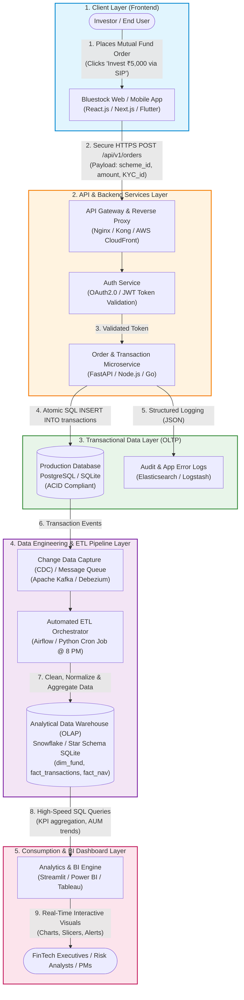

# Bluestock Fintech - Week 2: FinTech Domain & Software Fundamentals
## Deliverable 4: Software Development Concepts & End-to-End Data Flow Architecture

---

## 1. Executive Summary
In modern financial technology enterprises like **Bluestock**, data analysts work at the intersection of product, engineering, and financial intelligence. Understanding how user interactions in client applications generate telemetry and transactional records, flow through distributed pipelines, and aggregate into decision-grade analytics dashboards is essential for ensuring data integrity, debugging latency, and building reliable reporting systems.

---

## 2. End-to-End FinTech Data Flow Diagram

The following architecture diagram details the complete lifecycle: **User Action in Web Application $\longrightarrow$ Database Persistence $\longrightarrow$ Analytical Dashboard Visualization**.

---

## 3. Step-by-Step Data Flow Explanation

| Step | Component | Action Description | Data Format / Protocol |
| :--- | :--- | :--- | :--- |
| **Step 1** | **User Interaction** | The user selects an equity mutual fund scheme on Bluestock and clicks *"Invest ₹5,000 via Monthly SIP"*. | Client Event (DOM Click / Touch) |
| **Step 2** | **HTTP Request** | The web application dispatches an asynchronous `POST` request with JSON payload containing user credentials, scheme code, bank mandate, and amount. | HTTPS REST API (`JSON`) |
| **Step 3** | **API Gateway & Auth** | The gateway verifies the JSON Web Token (`JWT`), applies rate limits, and routes the validated request to the internal order microservice. | Header: `Authorization: Bearer <token>` |
| **Step 4** | **Transactional Write (OLTP)** | The order service executes an atomic SQL transaction: writing to `orders` and `investor_transactions` tables while updating user folio balance. | SQL `INSERT` / `UPDATE` (ACID) |
| **Step 5** | **Application Logging** | A structured event log (`INFO: Order #89421 created for user #3102`) is sent to centralized monitoring for debugging and fraud detection. | JSON logs (ELK Stack) |
| **Step 6** | **Streaming & Pipeline Ingestion** | The transactional database changes are captured via CDC/Kafka or scheduled night-batch ETL queries (`etl_pipeline.py`). | Event Stream / Polled Batch |
| **Step 7** | **Transformation & OLAP Load** | Raw transaction rows are cleaned, deduplicated, and loaded into an optimized **Star Schema** with dimension tables (`dim_fund`, `dim_date`) and fact tables (`fact_transactions`). | Dimensional Warehouse / SQLite |
| **Step 8** | **Analytical Querying** | The Business Intelligence engine issues analytical queries (`SELECT SUM(amount), category FROM fact_transactions GROUP BY category`) to compute metrics. | Optimized OLAP SQL |
| **Step 9** | **Dashboard Rendering** | Metrics render on interactive KPI cards, heatmaps, and trend lines in the Streamlit or Power BI dashboard for business decision-makers. | Interactive UI / WebGL Charts |

---

## 4. Fundamental Software Engineering Concepts for Data Analysts

### A. Frontend vs. Backend
* **Frontend (Client-Side):** Everything the user touches and interacts with in the browser (built with HTML, CSS, JavaScript/React, Flutter). Focuses on responsive UI, data validation, and user experience.
* **Backend (Server-Side):** The business logic, computational engines, and database connections running on remote servers or cloud containers (Python FastAPI, Node.js, Go). Enforces compliance, permissions, and security.

### B. Client–Server Architecture & REST APIs
* **Client-Server Model:** Distributed structure where clients (browsers, mobile devices) request resources and servers provide services.
* **REST (Representational State Transfer):** Stateless communication protocol using standard HTTP verbs:
  * `GET`: Fetch data (e.g., retrieve fund NAV).
  * `POST`: Submit new data (e.g., place an investment order).
  * `PUT`/`PATCH`: Update existing records (e.g., update KYC status).
  * `DELETE`: Remove records (e.g., cancel a scheduled SIP).

### C. Databases: OLTP vs. OLAP
* **OLTP (Online Transaction Processing):** Optimized for high-concurrency, row-level reading and writing (e.g., PostgreSQL, MySQL). Powers day-to-day user transactions with ACID guarantees.
* **OLAP (Online Analytical Processing):** Optimized for aggregated columnar queries across millions of rows (e.g., Snowflake, BigQuery, ClickHouse). Used by Data Analysts for reporting and business intelligence.

### D. Software Development Lifecycle (SDLC)
The structured engineering sequence adopted by FinTech engineering teams:
1. **Requirements & Scope:** Business analysts define investor needs and regulatory constraints.
2. **Design & Architecture:** Tech leads model API endpoints, system scale, and database schemas.
3. **Development:** Engineers implement backend microservices and frontend interfaces.
4. **Testing & QA:** Unit tests, integration tests, and security audits (penetration testing).
5. **Deployment (CI/CD):** Automated deployment pipelines push code to cloud staging/production.
6. **Monitoring & Maintenance:** Observability via metrics, error alerts, and ongoing data pipelines.
